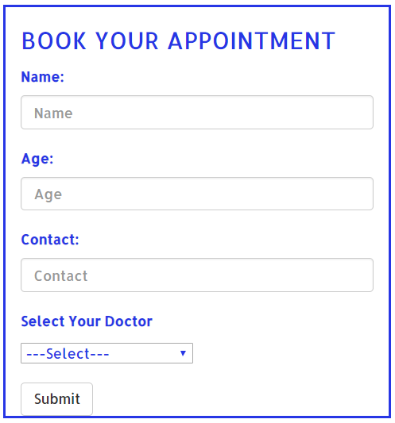
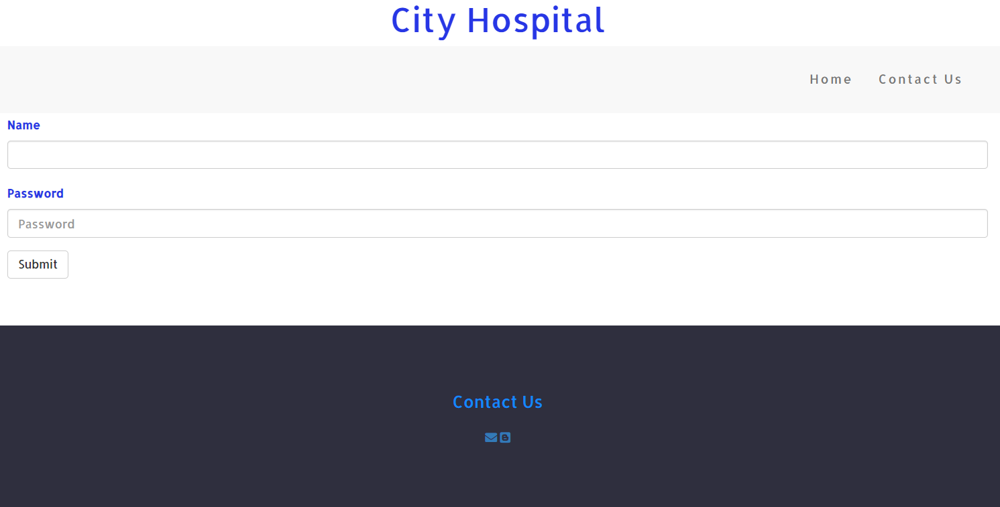
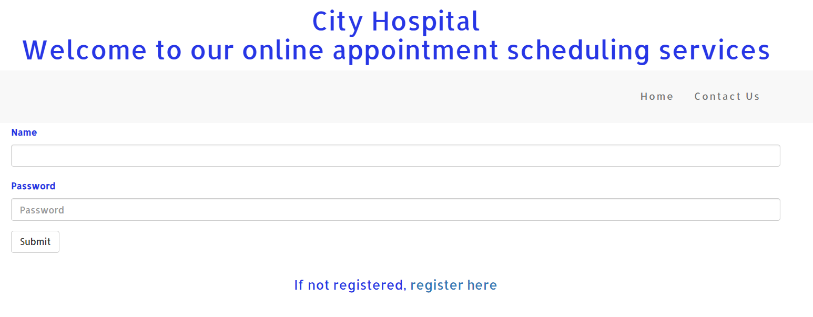

# Yrus---Retech2.0
Appointment Scheduling Systems
# retech2.0
##Appointment Scheduling Services

It provides a platform for patients to schedule their appointments online instead of picking phone and calling them .their will a login for doctor to get the patients details, and patients can visit the website and know about their doctors and appointment them ,according 
to their requirements.

**Getting Started **

A patient can get an appointment easily by filling up the necessary details.

The doctor can register his or her name with the hospital using an userid and a password.

The doctor can view the list of patients after logging in.

Features:

**Platforms**

*Languages used*
  HTML
  CSS
  BOOTSTARP
  
*Backend and tools*

 WAMP
mySQL 
 PHP
 
 
*References*

w3 schools 
getbootstrap.com

